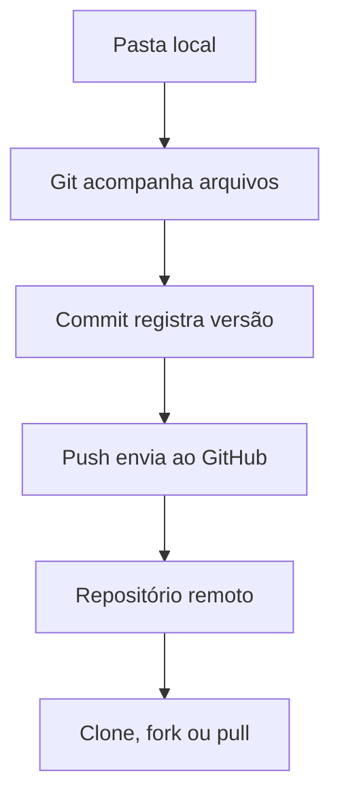
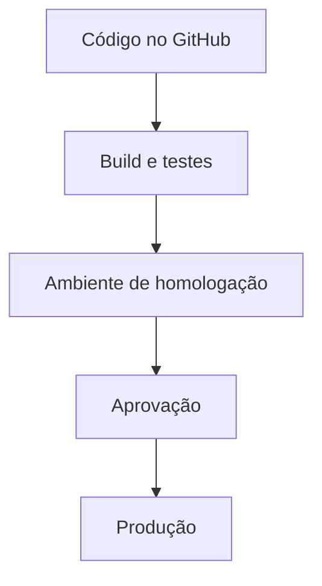

# Miniworkshop: publicação segura no GitHub

> Guia prático para preparar, proteger, publicar e manter um primeiro repositório.

## Sumário

1. [Estratégia recomendada](#1-estratégia-recomendada)
2. [O que são Git e GitHub](#2-o-que-são-git-e-github)
3. [Modelo de funcionamento](#3-modelo-de-funcionamento)
4. [Repositório público ou privado](#4-repositório-público-ou-privado)
5. [Estrutura mínima do repositório](#5-estrutura-mínima-do-repositório)
6. [Como o sistema de arquivos é organizado](#6-como-o-sistema-de-arquivos-é-organizado)
7. [O arquivo `.gitignore`](#7-o-arquivo-gitignore)
8. [O que nunca publicar](#8-o-que-nunca-publicar)
9. [Como tratar configurações secretas](#9-como-tratar-configurações-secretas)
10. [Branches e proteção do original](#10-branches-e-proteção-do-original)
11. [Forks](#11-forks)
12. [Stars, Watch, Fork e Clone](#12-stars-watch-fork-e-clone)
13. [Principais termos](#13-principais-termos)
14. [O que é deploy](#14-o-que-é-deploy)
15. [Idioma da publicação](#15-idioma-da-publicação)
16. [Como avaliar a aceitação](#16-como-avaliar-a-aceitação)
17. [Licença e propriedade intelectual](#17-licença-e-propriedade-intelectual)
18. [Autenticação segura](#18-autenticação-segura)
19. [Tamanho e arquivos binários](#19-tamanho-e-arquivos-binários)
20. [Processo seguro para a primeira publicação](#20-processo-seguro-para-a-primeira-publicação)
21. [Checklist de liberação pública](#21-checklist-de-liberação-pública)

## 1. Estratégia recomendada

A forma mais segura para uma primeira publicação é preparar a pasta localmente, eliminar dados sensíveis, criar inicialmente um repositório privado, testar o processo de clonagem e instalação e somente depois avaliar torná-lo público.

Não se deve começar pelo botão de upload. O ponto crítico está na auditoria anterior ao primeiro commit.

## 2. O que são Git e GitHub

GitHub é uma plataforma para armazenar, versionar, revisar e distribuir projetos. Ele utiliza o Git, mas Git e GitHub não são a mesma coisa.

| Conceito | Função |
|---|---|
| Git | Sistema instalado no computador que registra as versões dos arquivos |
| GitHub | Plataforma online que hospeda repositórios Git |
| Repositório | Pasta do projeto acompanhada pelo Git |
| Histórico | Conjunto de alterações registradas |
| Commit | Registro permanente de uma alteração |
| Push | Envio dos commits locais ao GitHub |
| Pull | Recebimento das alterações do GitHub |
| Clone | Cópia completa do repositório em outro computador |

O Git trabalha localmente. É possível criar commits sem internet. O GitHub é o servidor remoto onde o projeto pode ser compartilhado.

Fonte: [About Git — GitHub Docs](https://docs.github.com/en/get-started/using-git/about-git).

## 3. Modelo de funcionamento



O fluxo básico no terminal é:

```bash
git status
git add .
git commit -m "Descrição objetiva da alteração"
git push
```

Antes do primeiro `git add .`, devem ser revisados o conteúdo da pasta e a configuração do `.gitignore`.

## 4. Repositório público ou privado

Um repositório privado só pode ser acessado pelo proprietário e pelas pessoas autorizadas. É a opção recomendada para a primeira publicação, projetos comerciais, automações internas, código de clientes ou soluções com lógica proprietária.

Um repositório público pode ser lido e copiado por qualquer pessoa. Torná-lo privado posteriormente não garante que terceiros não tenham criado cópias durante o período público. Forks públicos também não se tornam privados automaticamente quando a visibilidade do original é alterada.

Importante: um repositório público não se torna automaticamente software de código aberto. A licença é o instrumento que estabelece o que terceiros estão autorizados a fazer.

Fonte: [Setting repository visibility — GitHub Docs](https://docs.github.com/repositories/managing-your-repositorys-settings-and-features/managing-repository-settings/setting-repository-visibility).

## 5. Estrutura mínima do repositório

A estrutura depende da tecnologia, mas um projeto profissional normalmente segue esta organização:

```text
nome-do-projeto/
├── README.md
├── LICENSE
├── .gitignore
├── .env.example
├── src/
├── tests/
├── docs/
├── examples/
├── config/
├── scripts/
├── package.json
└── .github/
    ├── workflows/
    ├── ISSUE_TEMPLATE/
    └── pull_request_template.md
```

| Item | Finalidade |
|---|---|
| `README.md` | Explica o projeto, instalação, uso e limitações |
| `.gitignore` | Impede que determinados arquivos sejam versionados |
| `.env.example` | Mostra as variáveis necessárias sem revelar valores reais |
| `LICENSE` | Define juridicamente como terceiros podem usar o projeto |
| `src/` | Código principal |
| `tests/` | Testes automatizados |
| `docs/` | Documentação complementar |
| `examples/` | Exemplos seguros de utilização |
| `.github/workflows/` | Automações de teste, build ou deploy |
| `CONTRIBUTING.md` | Regras para contribuições externas |
| `SECURITY.md` | Canal para comunicação de vulnerabilidades |
| `CHANGELOG.md` | Histórico legível das versões |

O conjunto mínimo para uma publicação pública séria é `README.md`, `.gitignore`, licença adequada e instruções reproduzíveis de instalação.

Fonte: [Best practices for repositories — GitHub Docs](https://docs.github.com/en/repositories/creating-and-managing-repositories/best-practices-for-repositories).

## 6. Como o sistema de arquivos é organizado

Para o Git, o diretório que contém a pasta oculta `.git` é a raiz do repositório.

```text
meu-projeto/
├── .git/          # Histórico e configuração do Git
├── .gitignore
├── README.md
└── src/
```

Tudo abaixo dessa raiz pode ser acompanhado pelo Git, exceto aquilo que for corretamente excluído.

A pasta `.git` não deve ser editada manualmente. Sua exclusão remove o vínculo local com o histórico, embora os arquivos do projeto permaneçam.

Como regra geral, cada projeto lógico deve possuir seu próprio repositório. Projetos independentes não devem ser agrupados em uma única pasta sem uma justificativa arquitetural, como um monorepo deliberadamente projetado.

## 7. O arquivo `.gitignore`

O `.gitignore` informa quais arquivos o Git não deve acompanhar.

Exemplo genérico:

```gitignore
# Credenciais e configurações locais
.env
.env.*
!.env.example
*.pem
*.key

# Dependências
node_modules/
vendor/
.venv/

# Arquivos temporários
tmp/
cache/
*.log

# Editor e sistema operacional
.vscode/
.idea/
.DS_Store
Thumbs.db

# Builds
dist/
build/
```

O `.gitignore` não remove um arquivo que já foi versionado. Se um segredo foi incluído em um commit, apagar o arquivo ou adicioná-lo ao `.gitignore` não apaga o segredo do histórico.

Nesse caso, a credencial deve ser imediatamente revogada, substituída e removida de todo o histórico.

Fonte: [Removing sensitive data from a repository — GitHub Docs](https://docs.github.com/en/authentication/keeping-your-account-and-data-secure/removing-sensitive-data-from-a-repository).

## 8. O que nunca publicar

| Conteúdo | Exemplos |
|---|---|
| Credenciais | Senhas, tokens, chaves de API e cookies |
| Arquivos de ambiente reais | `.env`, `.env.production` |
| Chaves privadas | SSH privada, certificados e arquivos `.pem` |
| Dados de clientes | Nomes, telefones, e-mails, documentos e conversas |
| Bancos reais | Dumps SQL, SQLite de produção e backups |
| Configurações de produção | URLs privadas, IPs e credenciais de servidores |
| Dados jurídicos protegidos | Contratos, procurações e documentos pessoais |
| Conteúdo de terceiros | Código, imagens ou fontes sem direito de redistribuição |
| Artefatos desnecessários | Logs, cache, dependências e builds pesados |

Também não devem ser publicados URLs de webhook que funcionem como credenciais, tokens do n8n, credenciais do Supabase, chaves de bots, tokens de Meta ou WhatsApp, arquivos de sessão ou volumes Docker com dados persistentes.

A regra operacional é: qualquer segredo enviado em um commit deve ser considerado comprometido, mesmo que o repositório fosse privado ou o commit tenha sido posteriormente apagado.

## 9. Como tratar configurações secretas

O código deve ler valores por meio de variáveis de ambiente:

```javascript
const apiKey = process.env.API_KEY;
```

O repositório contém somente um modelo sem valores reais:

```dotenv
# .env.example
API_KEY=
DATABASE_URL=
WEBHOOK_SECRET=
```

O valor verdadeiro permanece no `.env` local, no ambiente de produção ou em um gerenciador de secrets.

Para GitHub Actions, os valores sensíveis devem ser cadastrados nas configurações de secrets do repositório, nunca escritos no arquivo YAML.

Fonte: [GitHub Actions secrets — GitHub Docs](https://docs.github.com/en/rest/actions/secrets).

## 10. Branches e proteção do original

A branch principal normalmente se chama `main`. Ela representa a versão oficial do projeto. Uma branch secundária funciona como uma linha paralela de trabalho:

```text
main
└── feature/nova-integracao
```

O código é alterado na branch secundária, testado e submetido por pull request para ser incorporado à `main`.

| Proteção | Efeito |
|---|---|
| Bloquear force push | Evita reescrita destrutiva do histórico |
| Bloquear exclusão | Evita apagar a `main` |
| Exigir pull request | Impede alterações diretas |
| Exigir testes aprovados | Bloqueia código que falhe nas verificações |
| Exigir revisão | Obriga uma aprovação antes do merge |
| Restringir permissões | Limita quem pode escrever no repositório |

Mesmo em um projeto individual, branches e pull requests servem como mecanismo de revisão e proteção contra erros.

Fontes: [Managing protected branches](https://docs.github.com/repositories/configuring-branches-and-merges-in-your-repository/managing-protected-branches) e [About rulesets](https://docs.github.com/en/repositories/configuring-branches-and-merges-in-your-repository/managing-rulesets/about-rulesets).

## 11. Forks

Fork é uma cópia de um repositório criada dentro de outra conta. O fork permanece ligado ao repositório original, chamado de `upstream`, mas possui configurações e permissões próprias.

Alterações realizadas no fork não modificam o original. Para propor uma mudança ao projeto original, a pessoa abre um pull request.

| Branch | Fork |
|---|---|
| Existe dentro do mesmo repositório | É outro repositório |
| Normalmente usada pela equipe interna | Usado por terceiros ou pessoas sem acesso de escrita |
| Compartilha permissões do repositório | Possui permissões próprias |
| Não cria outra entidade de projeto | Cria uma cópia vinculada |

Fonte: [Forks — GitHub Docs](https://docs.github.com/en/pull-requests/reference/forks).

## 12. Stars, Watch, Fork e Clone

| Ação | Significado |
|---|---|
| Star | Salva o repositório como favorito e sinaliza interesse |
| Watch | Assina notificações sobre atividades do repositório |
| Fork | Cria uma cópia vinculada em outra conta |
| Clone | Baixa uma cópia completa para um computador |

Stars representam interesse aproximado, não necessariamente uso, qualidade ou aprovação técnica.

Fonte: [Saving repositories with stars — GitHub Docs](https://docs.github.com/en/get-started/exploring-projects-on-github/saving-repositories-with-stars).

## 13. Principais termos

| Termo | Significado |
|---|---|
| Commit | Registro lógico de uma alteração |
| Push | Envio dos commits para o GitHub |
| Pull | Atualização do repositório local |
| Branch | Linha independente de desenvolvimento |
| Pull request ou PR | Proposta formal de incorporação de mudanças |
| Review | Revisão de um pull request |
| Merge | Incorporação das mudanças |
| Conflict | Alterações incompatíveis que precisam ser resolvidas |
| Revert | Novo commit que desfaz outro |
| Tag | Identificação fixa de um ponto do histórico |
| Release | Versão distribuída do projeto |
| Issue | Registro de problema, ideia ou tarefa |
| Action | Automação executada pelo GitHub |
| Workflow | Arquivo que define uma automação |
| CI | Testes e verificações automáticas |
| CD | Entrega ou deploy automatizado |
| Remote | Endereço de um repositório remoto |
| Origin | Nome convencional do repositório remoto principal |
| Upstream | Repositório original ao qual um fork está ligado |
| HEAD | Referência para o commit atualmente selecionado |

## 14. O que é deploy

Publicar código no GitHub não significa colocar a aplicação em funcionamento.

`Push` envia o código ao repositório. `Deploy` instala uma versão desse código em um ambiente executável, como Vercel, Cloudflare, AWS, VPS, Docker ou outro servidor.



Um deploy pode ser manual ou automático. GitHub Actions pode executar testes e publicar a aplicação após um push. Ambientes podem exigir aprovação manual, restringir branches e proteger secrets antes do deploy.

Para uma primeira publicação, é recomendável separar as etapas: primeiro criar um repositório seguro; depois automatizar o deploy.

Fonte: [Deployments and environments — GitHub Docs](https://docs.github.com/en/actions/reference/workflows-and-actions/deployments-and-environments).

## 15. Idioma da publicação

| Público pretendido | Recomendação |
|---|---|
| Equipe ou clientes brasileiros | Português |
| Comunidade internacional | Inglês |
| Brasil e exterior | README principal em inglês e `README.pt-BR.md` |
| Projeto interno | Idioma adotado pela equipe |

Nomes de variáveis, funções, classes, commits técnicos e estrutura do código costumam ser mais interoperáveis em inglês. A documentação pode ser bilíngue.

O mais importante é manter um padrão, evitando mistura aleatória de idiomas dentro do código.

## 16. Como avaliar a aceitação

Um repositório é tecnicamente bem recebido quando uma pessoa desconhecida consegue compreender a proposta, instalar, executar um exemplo e identificar as limitações sem precisar conversar com o autor.

| Sinal | Interpretação |
|---|---|
| Instalação reproduzível | A documentação realmente funciona |
| Issues pertinentes | Pessoas estão testando ou usando |
| Pull requests | Existe interesse em contribuir |
| Downloads de releases | Há consumo de versões |
| Forks ativos | O projeto está sendo adaptado |
| Projetos dependentes | Outros projetos incorporaram o código |
| Retorno recorrente | O uso não foi apenas curiosidade |
| Stars | Interesse ou intenção de consultar novamente |

Muitas stars e nenhuma utilização verificável podem representar apenas divulgação. Poucas stars com usuários reais podem representar um projeto tecnicamente valioso.

## 17. Licença e propriedade intelectual

A licença define o que terceiros podem fazer com o projeto.

| Licença | Característica geral |
|---|---|
| MIT | Permissiva; admite uso comercial e modificação com manutenção dos avisos |
| Apache 2.0 | Permissiva; inclui disposições relacionadas a patentes |
| GPLv3 | Modificações distribuídas devem permanecer sob licença compatível |
| Proprietária | Uso condicionado aos termos do proprietário |
| Sem licença | Não concede permissão geral para reutilização |

A licença não deve ser escolhida automaticamente. Se o projeto representa vantagem comercial, uma licença permissiva pode autorizar concorrentes a utilizá-lo legalmente.

Também devem ser verificadas as licenças de dependências, imagens, fontes, templates e trechos de terceiros.

## 18. Autenticação segura

Ative autenticação em dois fatores e mantenha mais de um método de recuperação. Isso reduz o risco de perda de acesso à conta.

Para conectar o computador ao GitHub, as opções adequadas são GitHub Desktop, GitHub CLI autenticado pelo navegador ou SSH com chave protegida por senha.

O GitHub não aceita a senha comum da conta para operações Git por HTTPS. Quando um token for necessário, prefira um fine-grained personal access token, limitado aos repositórios necessários, com permissões mínimas e expiração.

Um token nunca deve ser enviado por mensagem, e-mail, arquivo de código ou commit.

Fontes: [About authentication to GitHub](https://docs.github.com/en/authentication/keeping-your-account-and-data-secure/about-authentication-to-github) e [Managing personal access tokens](https://docs.github.com/en/authentication/keeping-your-account-and-data-secure/managing-your-personal-access-tokens).

## 19. Tamanho e arquivos binários

Git não é adequado para backups gerais, vídeos, bancos de dados ou grandes arquivos binários.

O GitHub recomenda repositórios idealmente abaixo de 1 GB. Arquivos comuns são bloqueados ao atingir 100 MB; arquivos grandes devem usar Git LFS quando houver justificativa. Um único push possui limite de 2 GB.

Não devem ser incluídos `node_modules`, ambientes virtuais, imagens Docker, arquivos ZIP de backup ou bancos de produção.

Fontes: [Repository limits](https://docs.github.com/en/repositories/creating-and-managing-repositories/repository-limits) e [About large files on GitHub](https://docs.github.com/en/repositories/working-with-files/managing-large-files/about-large-files-on-github).

## 20. Processo seguro para a primeira publicação

O procedimento recomendado é:

1. Inventariar a pasta.
2. Identificar a tecnologia e a finalidade do projeto.
3. Procurar credenciais e dados pessoais.
4. Verificar arquivos grandes e desnecessários.
5. Criar o `.gitignore` adequado.
6. Criar um `.env.example` seguro.
7. Preparar o `README.md`.
8. Avaliar direitos autorais e licença.
9. Inicializar o Git localmente.
10. Conferir exatamente o que será versionado.
11. Criar inicialmente um repositório privado.
12. Fazer o primeiro push.
13. Clonar em ambiente separado e testar.
14. Configurar segurança e proteção da `main`.
15. Somente então decidir se o repositório será público.

O controle mais importante é a conferência anterior ao primeiro commit. Ela deve verificar tanto os nomes quanto o conteúdo dos arquivos e o histórico anterior, caso a pasta já tenha sido um repositório Git.

## 21. Checklist de liberação pública

| Controle | Resultado esperado |
|---|---|
| Segredos | Nenhuma chave, senha, token ou sessão |
| Dados pessoais | Nenhum dado real de cliente |
| `.gitignore` | Compatível com a tecnologia usada |
| `.env.example` | Somente nomes e exemplos fictícios |
| README | Instalação e uso testados do zero |
| Licença | Escolhida conscientemente |
| Dependências | Sem arquivos vendorizados desnecessários |
| Arquivos grandes | Nenhum binário inadequado |
| Direitos autorais | Conteúdo próprio ou autorizado |
| Branch principal | Protegida quando aplicável |
| Conta | 2FA e recuperação configuradas |
| Teste final | Clone limpo funciona |

## Conclusão

A publicação segura não começa no GitHub. Ela começa na auditoria da pasta local. A sequência correta é examinar, excluir riscos, documentar, versionar, publicar como privado, testar e somente depois decidir pela exposição pública.

O próximo estágio prático deve ser uma auditoria somente de leitura da pasta, seguida da criação do mapa de risco e da definição entre compartilhamento privado, público ou restrito a colaboradores.
